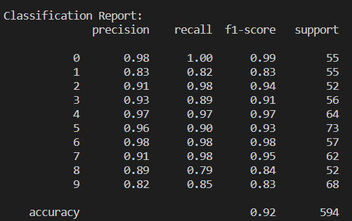

# ES654-2020 Assignment 3

*Raghav Goyal* - *18110135*

------

  

## K-Class Logistic Regression
---

 

### Dataset Used
- Digits dataset

 

### Accuracies
- Fold 1: Accuracy=91.333 %
- Fold 2: Accuracy=88.864 %
- Fold 3: Accuracy=95.322 %
- Fold 4: Accuracy=91.040 %

    **Average Accuracy**: 91.04 %

 

### Confusion Matrix
 

Overall Accuracy: 91.751 %

 

### Classification Report

 

 

### Analysis
- Most confused digits: 1, 9
- Easily predicted digits: 0

 

### PCA plot

 

#### Inferences
- Each digit occupies a distinct cluster in the 2D pprojected space
- The digit 6 has the most tightly bound cluster
- The digit 4 has the cluster with the minimum overlap due to distinct shape
- The digits 8 and 9 have high overlap in their clusters due to resemblance in shape

